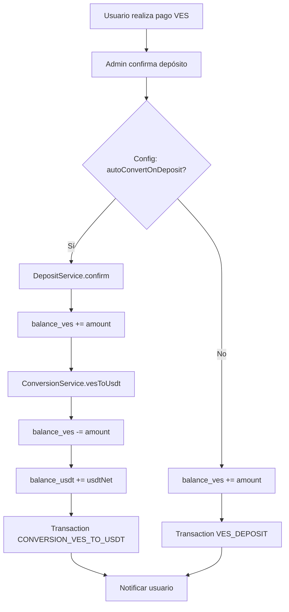
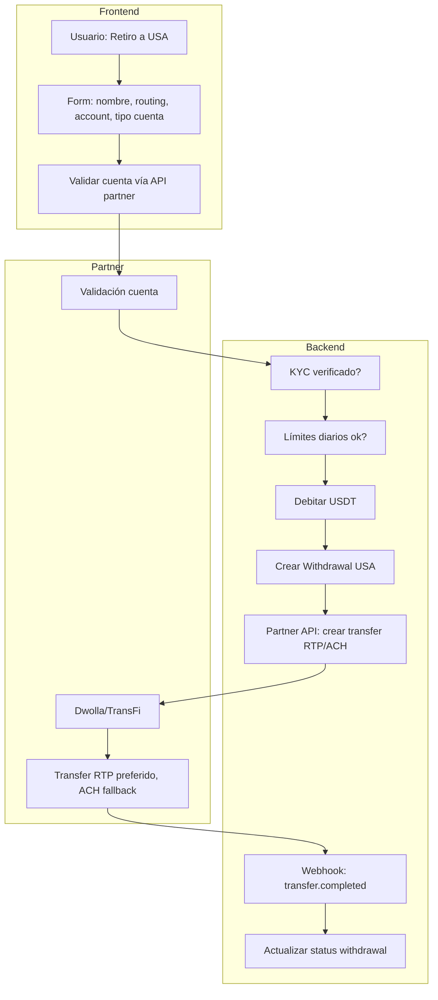
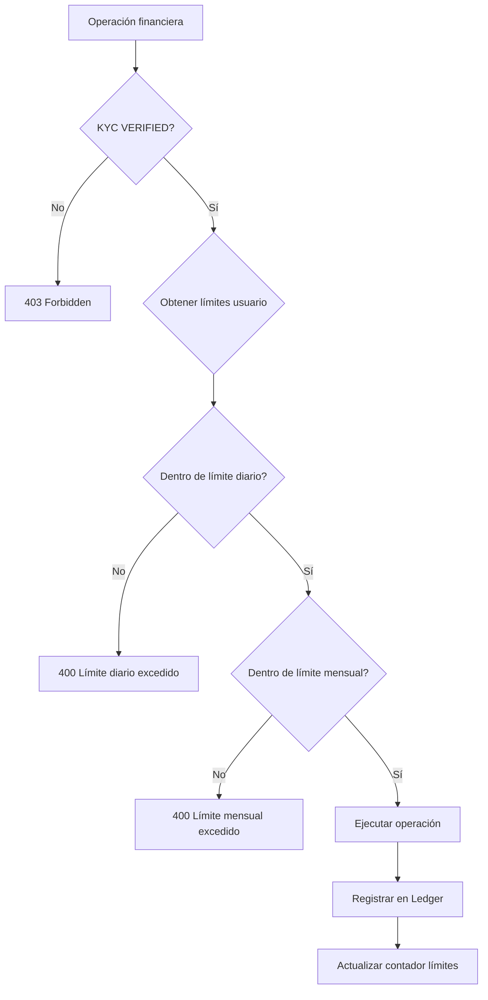

# Diseño: USDT Interno, Retiros a EE.UU. y Compliance

## 1. Análisis del Estado Actual

### Stack
- **Backend**: NestJS + Prisma + PostgreSQL
- **Frontend**: React Native (Expo/RN)
- **Auth**: JWT, MFA opcional
- **KYC**: Flujo básico (PENDING, UNDER_REVIEW, VERIFIED, REJECTED)

### Lo que ya existe
| Componente | Estado | Brecha |
|------------|--------|--------|
| Wallet dual VES/USDT | ✅ | Falta conversión automática al confirmar depósito |
| Depósitos VES | ✅ | Manual: admin confirma → balance_ves |
| P2P VES y USDT | ✅ | Ok |
| Conversión VES↔USDT | ✅ | Manual (usuario la ejecuta) |
| Zelle/Withdrawal | ✅ Parcial | Solo estructura; sin partner licenciado |
| KYC | ✅ Básico | Falta bloqueo de operaciones si KYC no verificado |
| Límites diarios/mensuales | ❌ | No existe |
| Retiros ACH/RTP | ❌ | No existe |
| Ledger/auditoría | ✅ Transaction + AuditLog | Falta ledger inmutable para compliance |

---

## 2. Diagramas de Flujo Conceptual

### 2.1 Flujo: Depósito VES → USDT automático



### 2.2 Flujo: Retiro a EE.UU. (Partner Dwolla/TransFi)



### 2.3 Flujo: Compliance (KYC + Límites)



---

## 3. Estructura de Base de Datos Propuesta

### 3.1 Nuevas tablas y campos

```prisma
// Configuración global (feature flags, tasas)
model SystemConfig {
  id        String   @id @default(cuid())
  key       String   @unique   // ej: "auto_convert_ves_on_deposit", "ves_usdt_rate"
  value     Json
  updatedAt DateTime @updatedAt
}

// Límites por nivel KYC (tier)
model LimitTier {
  id              String   @id @default(cuid())
  name            String   @unique   // "basic", "verified", "premium"
  dailyLimitUsdt  Decimal  @map("daily_limit_usdt")
  monthlyLimitUsdt Decimal @map("monthly_limit_usdt")
  User            User[]
}

// Añadir a User
model User {
  // ... existente
  limitTierId  String?  @map("limit_tier_id")
  limitTier    LimitTier? @relation(...)
}

// Cuenta bancaria USA (para retiros)
model BankAccount {
  id              String   @id @default(cuid())
  userId          String   @map("user_id")
  accountHolder   String   @map("account_holder")
  accountNumber   String   @map("account_number")  // encriptado
  routingNumber   String   @map("routing_number")
  accountType     String   @map("account_type")    // checking | savings
  bankName        String?  @map("bank_name")
  externalId      String?  @unique @map("external_id")  // ID en Dwolla
  status          String   @default("pending")    // pending | verified | failed
  createdAt       DateTime @default(now())
  user            User     @relation(...)
}

// Contadores de límites (por usuario, por día/mes)
model LimitUsage {
  id          String   @id @default(cuid())
  userId      String   @map("user_id")
  periodType  String   @map("period_type")  // "daily" | "monthly"
  periodKey   String   @map("period_key")   // "2025-03-05" | "2025-03"
  amountUsdt  Decimal  @map("amount_usdt")
  createdAt   DateTime @default(now())
  user        User     @relation(...)
  
  @@unique([userId, periodType, periodKey])
}

// Extender Withdrawal para retiros USA
// Añadir campos a Withdrawal:
//   destination: "zelle" | "usa_bank"
//   bankAccountId, partnerTransferId, etaMinutes, usdAmount, exchangeRate
```

### 3.2 Esquema extendido (fragmento)

```prisma
model Withdrawal {
  id                String   @id @default(cuid())
  userId            String   @map("user_id")
  amount            Decimal  @db.Decimal(18, 6)   // USDT debitado
  destination       String   // "zelle" | "usa_bank"
  destinationEmail  String?  @map("destination_email")
  destinationName   String?  @map("destination_name")
  bankAccountId     String?  @map("bank_account_id")
  partnerTransferId String?  @map("partner_transfer_id")
  usdAmount         Decimal? @map("usd_amount") @db.Decimal(18, 2)
  exchangeRate      Decimal? @map("exchange_rate") @db.Decimal(12, 6)
  fee               Decimal? @default(0) @db.Decimal(18, 6)
  etaMinutes        Int?     @map("eta_minutes")
  status            WithdrawalStatus
  metadata          Json?
  createdAt         DateTime
  updatedAt         DateTime?
  user              User     @relation(...)
  bankAccount       BankAccount? @relation(...)
}
```

---

## 4. Endpoints de API Propuestos

### 4.1 Nuevos endpoints

| Método | Ruta | Descripción | Auth |
|--------|------|-------------|------|
| POST | `/withdrawal/usa/validate-account` | Validar cuenta bancaria (vía partner) | JWT + KYC |
| POST | `/withdrawal/usa` | Crear retiro a EE.UU. | JWT + KYC |
| GET | `/withdrawal/usa` | Listar retiros USA | JWT |
| GET | `/withdrawal/usa/:id` | Detalle retiro + ETA | JWT |
| POST | `/webhooks/dwolla` | Webhook del partner | Signature |
| GET | `/limits` | Límites del usuario | JWT |
| PATCH | `/config/deposit` | Config auto-conversión (admin) | Admin |
| GET | `/bank-accounts` | Listar cuentas bancarias | JWT + KYC |
| POST | `/bank-accounts` | Añadir cuenta bancaria | JWT + KYC |
| DELETE | `/bank-accounts/:id` | Eliminar cuenta | JWT |

### 4.2 Request/Response de ejemplo

**POST /withdrawal/usa**

```json
// Request
{
  "bankAccountId": "clxyz123",
  "amountUsdt": 100,
  "note": "Pago mensual"
}

// Response
{
  "id": "wd_abc123",
  "status": "PROCESSING",
  "amountUsdt": 100,
  "usdAmount": 100,
  "fee": 2.5,
  "etaMinutes": 30,
  "estimatedCompletion": "2025-03-05T14:30:00Z"
}
```

---

## 5. Fragmentos de Código

### 5.1 Backend: Servicio de retiros USA (NestJS)

```typescript
// withdrawal-usa.service.ts
@Injectable()
export class WithdrawalUsaService {
  constructor(
    private prisma: PrismaService,
    private dwollaClient: DwollaClientService,
    private limitsService: LimitsService,
    private conversionService: ConversionService,
  ) {}

  async createWithdrawal(userId: string, dto: CreateWithdrawalUsaDto) {
    // 1. KYC + límites
    await this.limitsService.assertWithinLimits(userId, dto.amountUsdt);
    
    const bankAccount = await this.prisma.bankAccount.findFirst({
      where: { id: dto.bankAccountId, userId, status: 'verified' }
    });
    if (!bankAccount) throw new BadRequestException('Cuenta no válida');

    const usdAmount = dto.amountUsdt; // 1:1 USDT/USD
    const fee = this.calculateFee(dto.amountUsdt);

    return this.prisma.$transaction(async (tx) => {
      const wallet = await tx.wallet.findUnique({ where: { userId } });
      const total = new Decimal(dto.amountUsdt).plus(fee);
      if (new Decimal(wallet.balanceUsdt).lt(total))
        throw new BadRequestException('Saldo insuficiente');

      await tx.wallet.update({
        where: { userId },
        data: { balanceUsdt: new Decimal(wallet.balanceUsdt).minus(total) },
      });

      const withdrawal = await tx.withdrawal.create({
        data: {
          userId,
          amount: dto.amountUsdt,
          destination: 'usa_bank',
          bankAccountId: bankAccount.id,
          usdAmount,
          fee,
          status: 'PENDING',
          etaMinutes: 30,
        },
      });

      try {
        const transfer = await this.dwollaClient.createTransfer({
          source: this.getFundingSourceId(userId),
          destination: bankAccount.externalId,
          amount: usdAmount.toNumber(),
          currency: 'USD',
        });

        await tx.withdrawal.update({
          where: { id: withdrawal.id },
          data: {
            partnerTransferId: transfer.id,
            status: 'PROCESSING',
            metadata: { dwollaResource: transfer },
          },
        });

        await this.limitsService.recordUsage(userId, dto.amountUsdt);
      } catch (err) {
        await tx.withdrawal.update({
          where: { id: withdrawal.id },
          data: { status: 'FAILED', metadata: { error: err.message } },
        });
        await tx.wallet.update({
          where: { userId },
          data: { balanceUsdt: new Decimal(wallet.balanceUsdt).plus(total) },
        });
        throw err;
      }

      return withdrawal;
    });
  }
}
```

### 5.2 Backend: Guard KYC + Límites

```typescript
// kyc-verified.guard.ts
@Injectable()
export class KycVerifiedGuard implements CanActivate {
  constructor(private prisma: PrismaService) {}
  async canActivate(context: ExecutionContext): Promise<boolean> {
    const request = context.switchToHttp().getRequest();
    const user = request.user;
    const u = await this.prisma.user.findUnique({
      where: { id: user.id },
      select: { kycStatus: true },
    });
    if (u?.kycStatus !== 'VERIFIED') {
      throw new ForbiddenException('KYC verification required');
    }
    return true;
  }
}
```

### 5.3 Backend: Webhook Dwolla

```typescript
// webhooks.controller.ts
@Controller('webhooks')
export class WebhooksController {
  @Post('dwolla')
  async dwolla(@Req() req: Request, @Body() body: any) {
    if (!this.verifyDwollaSignature(req)) {
      throw new UnauthorizedException('Invalid signature');
    }
    if (body.topic === 'transfer_completed') {
      await this.withdrawalService.handleTransferCompleted(body.resourceId);
    }
    if (body.topic === 'transfer_failed') {
      await this.withdrawalService.handleTransferFailed(body.resourceId);
    }
    return { received: true };
  }
}
```

### 5.4 Backend: Conversión automática en depósito

```typescript
// deposit.service.ts - modificación en confirm()
async confirm(depositId: string) {
  const config = await this.getConfig('auto_convert_ves_on_deposit');
  const autoConvert = config?.value === true;

  await this.prisma.$transaction(async (tx) => {
    // ... actualizar deposit, wallet balance_ves
    if (autoConvert) {
      const rate = await this.conversionService.getVesToUsdtRate();
      const usdtNet = amountVes / rate * 0.99; // 1% fee
      await tx.wallet.update({
        where: { userId },
        data: {
          balanceVes: 0, // ya se acreditó, ahora convertimos
          balanceUsdt: new Decimal(wallet.balanceUsdt).plus(usdtNet),
        },
      });
      await tx.transaction.create({
        data: { type: 'CONVERSION_VES_TO_USDT', ... },
      });
    }
  });
}
```

### 5.5 Frontend: Pantalla Retiro USA (React Native)

```tsx
// USAWithdrawalScreen.tsx - fragmento
const USAWithdrawalScreen = () => {
  const [bankAccountId, setBankAccountId] = useState('');
  const [amount, setAmount] = useState('');
  const { data: balance } = useQuery(['wallet'], () => walletApi.getBalance());
  const { data: limits } = useQuery(['limits'], () => limitsApi.get());

  const handleWithdraw = async () => {
    const res = await withdrawalUsaApi.create({
      bankAccountId,
      amountUsdt: parseFloat(amount),
    });
    Alert.alert(
      'Retiro enviado',
      `ETA: ${res.etaMinutes} min. Te notificaremos al completar.`
    );
    navigation.goBack();
  };

  return (
    <ScrollView>
      <Text>Saldo: {balance?.balanceUsdt} USDT</Text>
      <Text>Límite diario: {limits?.dailyRemaining} USDT</Text>
      <BankAccountSelector value={bankAccountId} onChange={setBankAccountId} />
      <TextInput
        placeholder="Monto USDT"
        value={amount}
        onChangeText={setAmount}
        keyboardType="decimal-pad"
      />
      <Text>Fee: 2.5% • ETA: ~30 min (RTP) / 1-3 días (ACH)</Text>
      <Button title="Enviar a mi cuenta USA" onPress={handleWithdraw} />
    </ScrollView>
  );
};
```

### 5.6 Frontend: Mostrar saldo principal en USDT

```tsx
// HomeScreen.tsx - priorizar USDT
<View style={styles.mainBalance}>
  <Text style={styles.label}>Tu saldo</Text>
  <Text style={styles.amount}>{balanceUsdt} USDT</Text>
  <Text style={styles.vesSecondary}>≈ {balanceVes} VES</Text>
</View>
```

---

## 6. Compliance y Seguridad

| Requisito | Implementación |
|-----------|----------------|
| KYC obligatorio | `KycVerifiedGuard` en todos los endpoints de retiro/transferencia |
| Ledger inmutable | Tabla `Transaction`; evitar updates/deletes; append-only |
| Límites diarios/mensuales | `LimitUsage` + `LimitTier`; verificar antes de cada operación |
| Auditoría | `AuditLog` en operaciones sensibles; incluir IP, userAgent |
| Reintentos | Job en background (Bull) para reintentar ACH fallidos con backoff |
| Manejo de errores | Try/catch + rollback en transacciones; notificar usuario |

---

## 7. Integración Partner (Dwolla vs TransFi)

| Partner | Pros | Contras |
|---------|------|---------|
| **Dwolla** | RTP + ACH, amplia adopción, webhooks robustos | Requiere cuenta Dwolla, KYC propio |
| **TransFi** | API más simple, soporte LATAM | Menos documentación pública |

**Recomendación**: Dwolla para retiros USA (RTP preferido, ACH fallback). TransFi si necesitas payout en otras jurisdicciones.

---

## 8. Resumen de Modificaciones por Módulo

| Módulo | Cambios |
|--------|---------|
| **Deposit** | Añadir flag `auto_convert_ves_on_deposit`; en `confirm()` opcionalmente convertir VES→USDT |
| **Wallet** | Exponer `balanceUsdt` como saldo principal; `balanceVes` secundario |
| **Withdrawal** | Nuevo tipo `usa_bank`; integración Dwolla; `BankAccount`; webhooks |
| **Transfer** | Añadir `KycVerifiedGuard`; verificación de límites |
| **Limits** | Nuevo módulo: `LimitTier`, `LimitUsage`, servicio de verificación |
| **KYC** | Bloquear operaciones si no VERIFIED; guard global en rutas financieras |
| **Frontend** | Pantalla USA Withdrawal, BankAccount CRUD, notificaciones de estado, saldo en USDT |
| **Config** | Tabla `SystemConfig` para feature flags y tasas |

---

## 9. Próximos Pasos

1. **Fase 1**: Conversión automática VES→USDT en depósito + priorizar USDT en UI  
2. **Fase 2**: Límites (LimitTier, LimitUsage) + KycVerifiedGuard  
3. **Fase 3**: BankAccount + integración Dwolla (sandbox primero)  
4. **Fase 4**: Webhooks, reintentos, notificaciones push  
