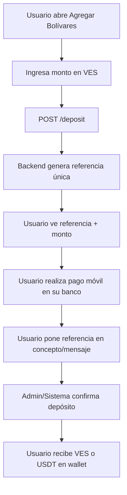
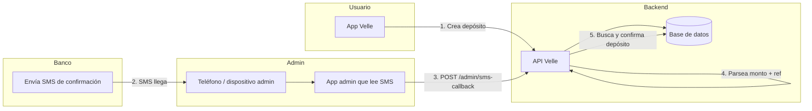

# Proceso de Pago Móvil - Documentación

Este documento describe el flujo completo del depósito por pago móvil en Velle, desde que el usuario solicita agregar bolívares hasta la confirmación automática o manual.

---

## Tabla de contenidos

1. [Resumen ejecutivo](#1-resumen-ejecutivo)
2. [Flujo del usuario](#2-flujo-del-usuario)
3. [Flujo del administrador](#3-flujo-del-administrador)
4. [Automatización por SMS (cuenta de administración)](#4-automatización-por-sms-cuenta-de-administración)
5. [Modelo de datos y API](#5-modelo-de-datos-y-api)
6. [Formato de referencia](#6-formato-de-referencia)
7. [Parsers por banco (SMS)](#7-parsers-por-banco-sms)
8. [Consideraciones de operación](#8-consideraciones-de-operación)

---

## 1. Resumen ejecutivo

| Concepto | Descripción |
|----------|-------------|
| **Qué es** | Depósito en bolívares (VES) que el usuario realiza vía pago móvil o transferencia bancaria a una cuenta corporativa de Velle. |
| **Objetivo** | Acreditar VES en la wallet del usuario y, opcionalmente, convertir a USDT automáticamente. |
| **Confirmación actual** | Manual: un admin llama `POST /deposit/:id/confirm`. |
| **Confirmación automática** | Posible vía SMS: un dispositivo admin recibe el SMS del banco y lo reenvía al backend; el backend parsea y confirma. |

---

## 2. Flujo del usuario



### Pasos detallados

1. **Usuario ingresa monto**  
   En `DepositScreen`, el usuario introduce el monto en bolívares (ej: 1000).

2. **Backend crea depósito**  
   `POST /deposit` con `{ amount: 1000 }`:
   - Crea registro `Deposit` con status `PENDING`
   - Genera referencia: `DEP-{timestamp}-{userIdSuffix}` (ej: `DEP-1709654321000-ABC123`)
   - Devuelve: `id`, `amount`, `reference`, `instructions`

3. **Usuario realiza el pago**  
   - Abre la app de su banco (Mercantil, Banesco, Provincial, etc.)
   - Hace pago móvil o transferencia a la **cuenta bancaria de Velle**
   - Monto: exactamente el indicado
   - Concepto/mensaje: pega la **referencia** (ej: `DEP-1709654321000-ABC123`)

4. **Espera confirmación**  
   El depósito queda en `PENDING` hasta que un admin o el sistema lo confirme.

5. **Confirmación**  
   Cuando se confirma:
   - Si `auto_convert_ves_on_deposit` está activo: se convierte a USDT y se acredita en `balance_usdt`
   - Si no: se acredita en `balance_ves`

---

## 3. Flujo del administrador

### 3.1 Confirmación manual (actual)

1. El admin recibe el SMS del banco en su teléfono (cuenta Velle).
2. Compara monto y referencia con los depósitos pendientes.
3. Llama al endpoint:
   ```
   POST /deposit/{depositId}/confirm
   ```
4. El backend actualiza el depósito, la wallet y crea transacciones.

### 3.2 Panel admin (futuro)

Un panel podría listar depósitos `PENDING` y permitir confirmar/rechazar desde la interfaz.

---

## 4. Automatización por SMS (cuenta de administración)

Para reducir trabajo manual, se puede automatizar la confirmación leyendo SMS desde el dispositivo donde llegan las notificaciones del banco.

### 4.1 Arquitectura



### 4.2 Flujo automatizado

1. **Dispositivo admin**  
   Teléfono o dispositivo Android donde el banco envía los SMS de pago móvil (número registrado en la cuenta de Velle).

2. **App admin**  
   - Permiso `READ_SMS`
   - Escucha SMS entrantes
   - Filtra por remitente (número o shortcode del banco)
   - Parsea monto y referencia según el formato del banco
   - Envía `POST /admin/sms-callback` con `{ amount, reference, sender, raw }`

3. **Backend**  
   - Valida token/API key de admin
   - Busca `Deposit` con `reference` y status `PENDING`
   - Verifica que `amount` coincida (o tolerancia configurada)
   - Llama `DepositService.confirm(depositId)`

### 4.3 Endpoint propuesto (pendiente implementar)

```
POST /admin/sms-callback
Authorization: Bearer {admin_token}  (o API key en header)
Content-Type: application/json

{
  "amount": 1000,
  "reference": "DEP-1709654321000-ABC123",
  "sender": "MERCANTIL",
  "raw": "texto completo del SMS"
}
```

### 4.4 Requisitos del dispositivo admin

| Requisito | Descripción |
|-----------|-------------|
| SIM | Número que tiene el banco registrado para recibir notificaciones |
| Internet | Para enviar los datos al backend |
| Batería/corriente | Debe estar encendido de forma continua |
| App admin | App interna (no en Play Store) con permisos SMS |

---

## 5. Modelo de datos y API

### 5.1 Modelo Deposit (Prisma)

```prisma
model Deposit {
  id        String       @id @default(cuid())
  userId    String       @map("user_id")
  amount    Decimal      @db.Decimal(18, 2)
  reference String       @unique
  status    DepositStatus @default(PENDING)
  createdAt DateTime     @default(now()) @map("created_at")

  user      User         @relation(...)
}

enum DepositStatus {
  PENDING
  CONFIRMED
  REJECTED
}
```

### 5.2 Endpoints

| Método | Ruta | Auth | Descripción |
|--------|------|------|-------------|
| POST | `/deposit` | JWT user | Crear depósito, obtener referencia |
| GET | `/deposit` | JWT user | Listar depósitos del usuario |
| POST | `/deposit/:id/confirm` | Admin* | Confirmar depósito |
| POST | `/deposit/:id/reject` | Admin* | Rechazar depósito |

\* Actualmente no hay guard de rol; en producción debe restringirse a admin.

### 5.3 Respuesta de `POST /deposit`

```json
{
  "id": "clxxx...",
  "amount": 1000,
  "reference": "DEP-1709654321000-ABC123",
  "status": "PENDING",
  "instructions": "Realiza tu pago móvil o transferencia bancaria usando la referencia anterior. El administrador confirmará tu depósito."
}
```

---

## 6. Formato de referencia

- Patrón: `DEP-{timestamp}-{userIdSuffix}`
- Ejemplo: `DEP-1709654321000-ABC123`
- El usuario debe usar **exactamente** esta referencia en el concepto/mensaje del pago móvil.
- Es única por depósito (`reference` es `@unique` en la BD).

---

## 7. Parsers por banco (SMS)

Cada banco envía SMS con formato distinto. Para automatizar, hace falta un parser por banco.

### Ejemplos de formatos (ilustrativos)

| Banco | Ejemplo de SMS |
|-------|----------------|
| Mercantil | "Recibiste Bs. 1.000,00 de Juan Perez. Ref: DEP-1709654321000-ABC123" |
| Banesco | "Pago movil recibido: Bs 1000. Ref: DEP-1709654321000-ABC123" |
| Provincial | "Recibiste 1000 Bs. Referencia: DEP-1709654321000-ABC123" |

### Estructura de parser (conceptual)

```typescript
interface SmsParseResult {
  amount: number;
  reference: string | null;
  sender: string;
  bank?: string;
}

function parseSmsByBank(raw: string, senderShortcode: string): SmsParseResult | null {
  // Detectar banco por shortcode o contenido
  // Extraer monto (regex según formato)
  // Extraer referencia (buscar patron DEP-...)
  return { amount, reference, sender, bank };
}
```

Cada banco que se soporte requiere definir su parser concreto.

---

## 8. Consideraciones de operación

### 8.1 Cuenta bancaria de Velle

- Velle debe tener al menos una cuenta bancaria (VES) donde los usuarios hacen el pago móvil.
- El número de teléfono registrado en esa cuenta es el que recibe los SMS.
- Ese número debe estar en el dispositivo donde corre la app admin (o el sistema que reciba los SMS).

### 8.2 Tolerancia de monto

- Idealmente monto exacto.
- Opcional: tolerancia de centavos o pequeñas diferencias por redondeo (configurable).

### 8.3 Depósitos huérfanos

- Si llega un SMS sin depósito pendiente con esa referencia: registrar en log, no confirmar.
- Si hay múltiples depósitos con la misma referencia (no debería): política definida (ej: solo el primero, o rechazar).

### 8.4 Seguridad del endpoint SMS

- El endpoint `/admin/sms-callback` debe estar protegido (API key o token admin).
- Validar que el payload venga de la app admin y no de terceros.

### 8.5 Conversión automática

- Variable `auto_convert_ves_on_deposit` (SystemConfig): si `true`, al confirmar se convierte VES→USDT y se acredita USDT.
- Tasa: `VES_USDT_RATE` (env).
- Fee de conversión: 1% sobre el USDT bruto.

---

## Referencias

- `backend/src/deposit/deposit.service.ts` – Lógica de creación y confirmación
- `backend/src/deposit/deposit.controller.ts` – Endpoints
- `mobile/src/screens/wallet/DepositScreen.tsx` – UI de depósito
- `FINTECH_IMPLEMENTATION.md` – Contexto general del flujo financiero
